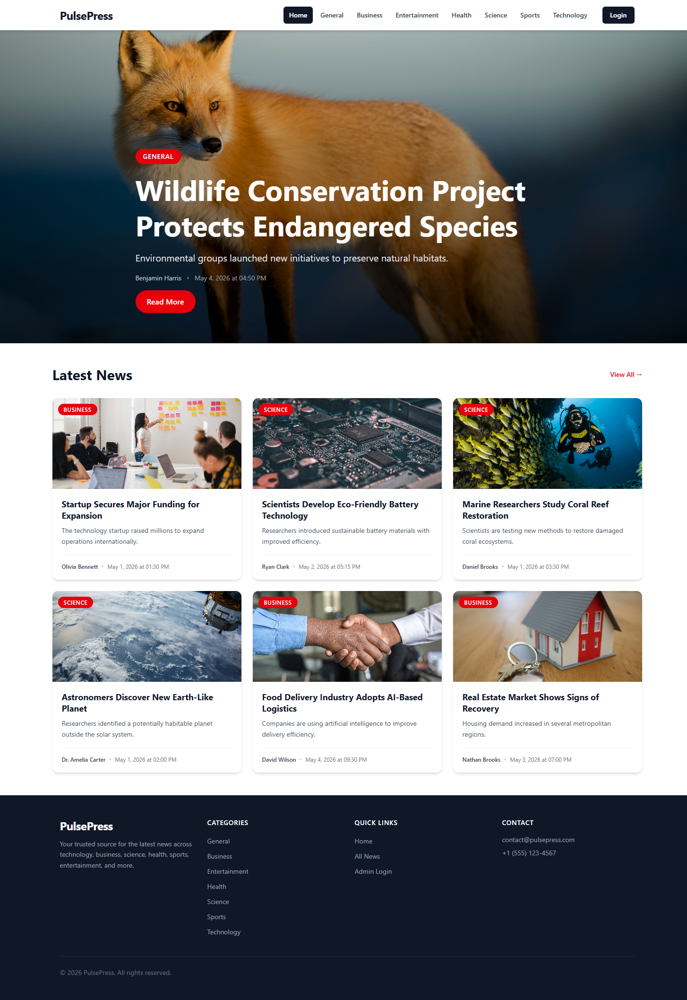
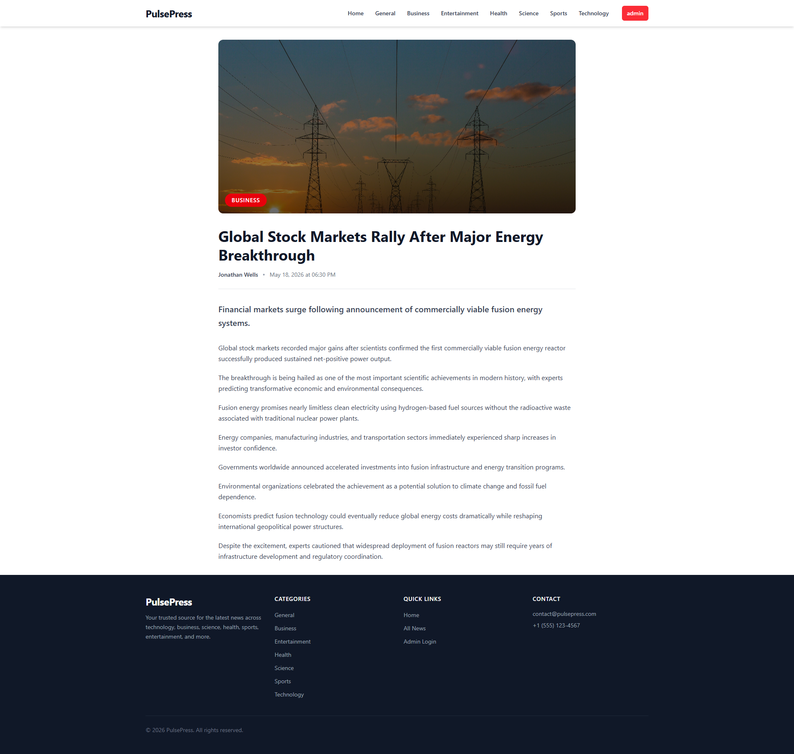
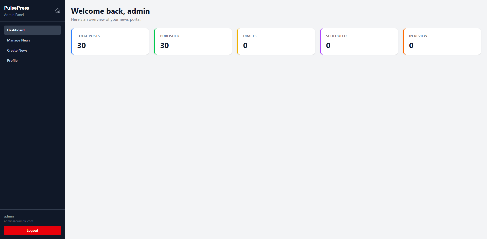
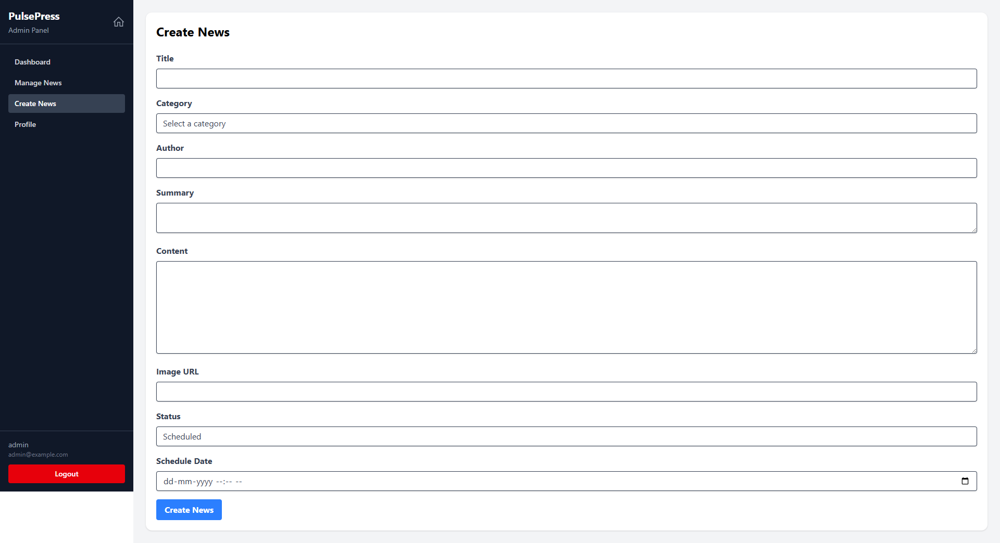

# PulsePress — News Portal

A full-stack news content management system built with the MERN stack (MongoDB, Express, React, Node.js). Features a News Portal with category browsing and a private admin dashboard for managing articles.

## Tech Stack

**Frontend** — React 19, Vite 8, Tailwind CSS 4, React Router 7, React Hook Form + Yup, Axios

**Backend** — Node.js, Express 5, MongoDB (Mongoose), JWT authentication (httpOnly cookies), bcryptjs

## Features

- Browse news by category (General, Business, Entertainment, Health, Science, Sports, Technology)
- Responsive masonry-style news grid with hero banner
- SEO-friendly single article pages using slugs
- Admin authentication (login/logout)
- Admin CMS dashboard — create, edit, delete news articles
- Article status workflow: draft, scheduled, in-review, published
- Scheduled publishing support
- Admin profile & password management
- Protected admin routes with JWT middleware
- Full-text search index on articles
- Public users can only access published articles, while admin users can manage all article states through the CMS dashboard.


## Project Structure

```
├── backend/
│   └── src/
│       ├── config/          # Database connection
│       ├── controllers/     # Route handlers (auth, news, admin/news)
│       ├── middleware/      # Auth & admin guards
│       ├── models/          # Mongoose schemas (User, News)
│       └── routes/          # Express routers
│       └── server.js        # App entry point
├── frontend/
│   └── src/
│       ├── components/      # Reusable UI (Navbar, Footer, Modals, etc.)
│       ├── context/         # Auth & News React contexts
│       ├── hooks/           # Custom hooks
│       ├── layouts/         # MainLayout & AdminLayout
│       ├── pages/           # Public & Admin pages
│       ├── routes/          # Route definitions
│       ├── services/        # Axios API client
│       ├── utils/           # Utility functions
│       └── validation/      # Yup schemas
└── README.md
```

## Getting Started

### Prerequisites

- Node.js >= 18
- MongoDB instance (local or Atlas)

### 1. Clone & Install

```bash
git clone https://github.com/shikeshjayan/pulsepress-news-portal.git
cd pulsepress-news-portal

# Install backend dependencies
cd backend
npm install

# Install frontend dependencies
cd ../frontend
npm install
```

### 2. Environment Variables

Create `backend/.env`:

```env
MONGO_URL=mongodb://localhost:27017/pulsepress
JWT_SECRET=your-secret-key
PORT=5000
```

### 3. Run the App

```bash
# Terminal 1 — Backend
cd backend
npm run dev

# Terminal 2 — Frontend
cd frontend
npm run dev
```

- **Frontend** → http://localhost:5173
- **Backend API** → http://localhost:5000

### 4. Demo Admin Credentials

1. Visit the app and click **Login** in the navbar
2. Email - admin@pulsepress.com
3. Password - admin@123

## API Endpoints

### Public

| Method | Endpoint              | Description              |
| ------ | --------------------- | ------------------------ |
| GET    | `/api/news`           | All published news       |
| GET    | `/api/news/:slug`     | Single article by slug   |
| GET    | `/api/news/category/:category` | Filter by category |

### Auth

| Method | Endpoint                    | Description          |
| ------ | --------------------------- | -------------------- |
| POST   | `/api/auth/login`           | Log in               |
| POST   | `/api/auth/logout`          | Log out              |
| GET    | `/api/auth/profile`         | Get profile (auth)   |
| PUT    | `/api/auth/change-password` | Change password (auth) |

### Admin (requires auth + admin role)

| Method | Endpoint               | Description        |
| ------ | ---------------------- | ------------------ |
| GET    | `/api/admin/news`      | All articles       |
| POST   | `/api/admin/news`      | Create article     |
| PUT    | `/api/admin/news/:id`  | Update article     |
| DELETE | `/api/admin/news/:id`  | Delete article     |

## Scripts

### Backend

| Command        | Description                |
| -------------- | -------------------------- |
| `npm run dev`  | Start with nodemon (watch) |
| `npm start`    | Start in production        |

### Frontend

| Command           | Description              |
| ----------------- | ------------------------ |
| `npm run dev`     | Vite dev server          |
| `npm run build`   | Production build         |
| `npm run preview` | Preview production build |

## Screenshots

### Home Page



### Article Page



### Admin Dashboard



### Create News



## License

MIT
